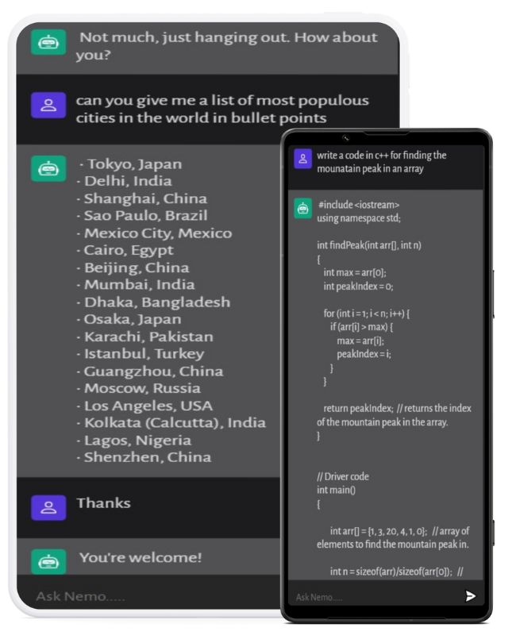

<h3>Nemo is an AI Bot with an elegant user interface that resembles the ChatGPT app, communicating with advanced GPT3 model API. It returns the most logical textual data on the given question be it any question related to personal life or coding.

   
  

  
Text Stacks and Frameworks:
   

1) JS
2) Node JS
3) VITE
4) Express JS
5) Open AI
<h3>
 
  

  

  

Live Site: https://nemo-ai-bot-sp10.netlify.app/

