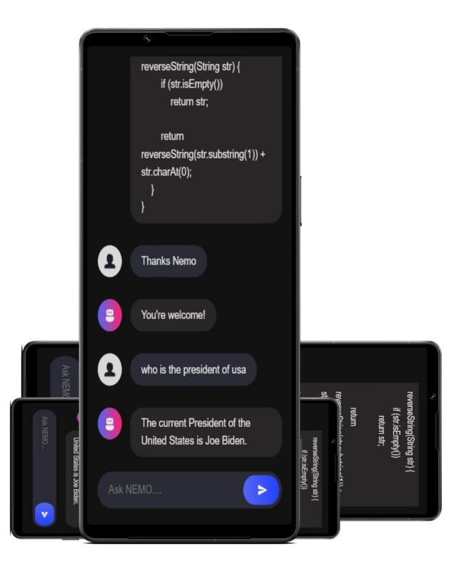

## NEMO - AI BUDDY

Nemo is an AI Bot with an elegant user interface that resembles the ChatGPT app, communicating with advanced GPT3 model API. It returns the most logical textual data on the given question be it any question related to personal life or coding.
  
## Text Stacks and Frameworks:


1) JS
2) Node JS
3) VITE
4) Vue JS
5) Express JS
6) Open AI
<h3>
<br>
  
<p align="center">
  
</p>


Live Site: https://nemo-ai-bot-chat.netlify.app/
<hr>

## Getting Started

First, run the development server:

```bash
npm run dev
# or
yarn dev
```

Open [http://localhost:3000](http://localhost:3000) with your browser to see the result.

You can start editing the page by modifying `pages/index.js`. The page auto-updates as you edit the file.

[API routes](https://nextjs.org/docs/api-routes/introduction) can be accessed on [http://localhost:3000/api/hello](http://localhost:3000/api/hello). This endpoint can be edited in `pages/api/hello.js`.

The `pages/api` directory is mapped to `/api/*`. Files in this directory are treated as [API routes](https://nextjs.org/docs/api-routes/introduction) instead of React pages.


## Deploy on Netlify

The easiest way to deploy any app is to use the [Netlify Platform](https://app.netlify.com/sites/nemo-ai-bot-chat/overview).
<br>
Check out the Netlify deployment documentation for more info (https://docs.netlify.com/)
